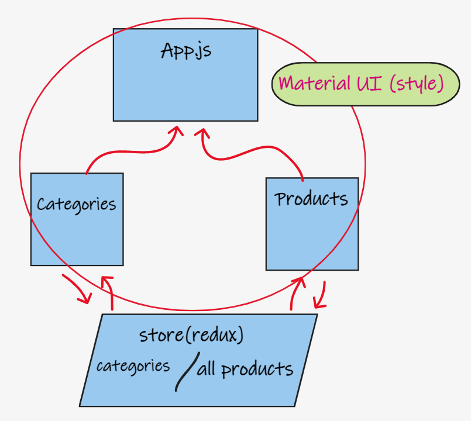

# storefront

## description

- Create a store app
  - phase1
    - setup the basic scaffolding of the application with initial styling and basic behaviors. This initial build sets up the file structure and state management so that we can progressively build this application in a scalable manner
  - phase2
    - adding the “Add to Cart” feature to our application, which will allow our users to not only browse items in the store, but also select them and have them persist in their “shopping cart” for later purchase.

## features

- React.js
- Material UI

## deploy

[netlify](https://lucid-hermann-4f6fd6.netlify.app/)

## UML

